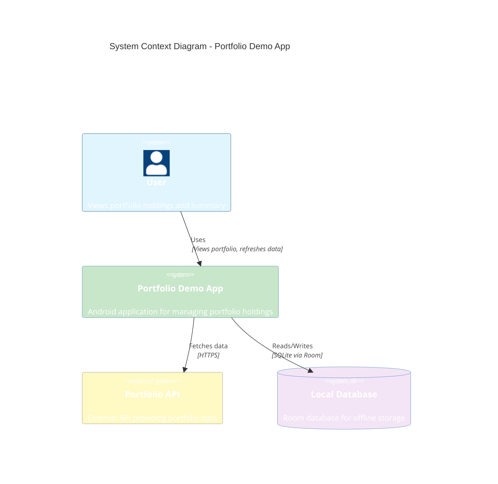
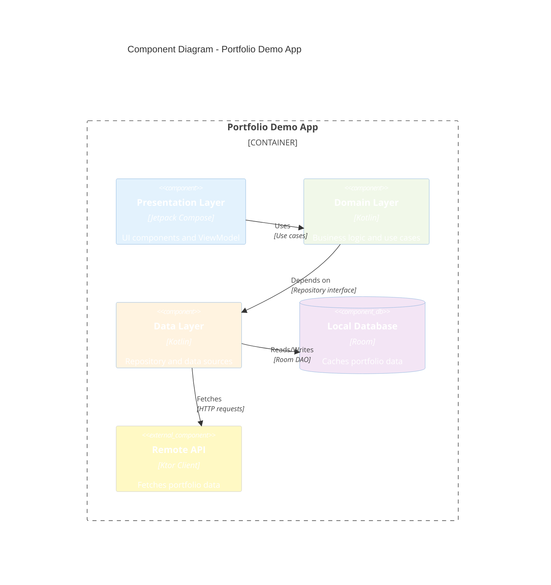
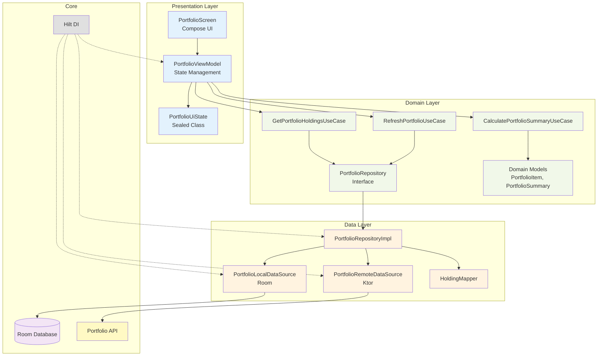

# Portfolio Demo App

A modern Android application built with Jetpack Compose that displays and manages portfolio holdings. The app follows **MVVM Clean Architecture** principles with an **offline-first strategy** to ensure a seamless user experience even when network connectivity is unavailable.

## 🎯 Overview

This application fetches portfolio holdings from a remote API, stores them locally using Room database, and displays them with real-time calculations for portfolio summary including current value, total investment, P&L, and today's P&L.

## 🏗️ Architecture

The project follows **Clean Architecture** with clear separation of concerns across three main layers:

### Layer Structure

```
┌─────────────────────────────────────┐
│      Presentation Layer             │
│  (UI, ViewModel, State Management)  │
├─────────────────────────────────────┤
│       Domain Layer                  │
│  (Use Cases, Business Logic)       │
├─────────────────────────────────────┤
│        Data Layer                   │
│  (Repository, Data Sources)         │
└─────────────────────────────────────┘
```

### MVVM Pattern

- **Model**: Domain models (`PortfolioItem`, `PortfolioSummary`)
- **View**: Jetpack Compose UI components (`PortfolioScreen`, `HoldingsList`, etc.)
- **ViewModel**: `PortfolioViewModel` - manages UI state and business logic coordination

### Key Components

- **Presentation Layer**: Jetpack Compose UI, ViewModel, UI State
- **Domain Layer**: Use cases, domain models, repository interfaces
- **Data Layer**: Repository implementation, local data source (Room), remote data source (Ktor)

## 💰 Why BigDecimal for Calculations?

Financial calculations require **precision and accuracy**. Using `Double` or `Float` can lead to rounding errors and precision loss, which is unacceptable when dealing with money.

### Benefits of BigDecimal:

1. **Precision**: Exact decimal representation without floating-point errors
2. **Accuracy**: Critical for financial calculations where even small errors compound
3. **Control**: Explicit rounding modes (`HALF_UP`, `HALF_DOWN`, etc.)
4. **Scale Management**: Control over decimal places (e.g., 2 decimal places for currency)

### Example from the codebase:

```kotlin
// Calculate total PNL percentage with precise rounding
val totalPnlPercentage = if (totalInvestment > BigDecimal.ZERO) {
    (totalPnl.divide(totalInvestment, 4, RoundingMode.HALF_UP) * BigDecimal(100))
        .setScale(2, RoundingMode.HALF_UP)
} else {
    BigDecimal.ZERO
}
```

This ensures that calculations like:
- Current Value = Σ(LTP × Quantity)
- Total Investment = Σ(AvgPrice × Quantity)
- Total PNL = Current Value - Total Investment
- PNL Percentage = (Total PNL / Total Investment) × 100

...are all calculated with financial-grade precision.

## ⚡ Why Kotlin Serialization & Ktor Client for Performance?

The app uses **Kotlin Serialization** and **Ktor Client** instead of alternatives like Gson/Retrofit or Moshi/OkHttp for superior performance and better integration with Kotlin coroutines.

### Why Ktor Client?

**Ktor Client** is a modern, lightweight HTTP client built from the ground up for Kotlin and coroutines, offering significant performance advantages:

1. **Native Coroutine Support**: Built-in suspend functions eliminate callback overhead and thread switching
   ```kotlin
   // Simple, efficient suspend function - no callbacks or thread pools
   suspend fun getPortfolioHoldings(): PortfolioResponse {
       return httpClient.get(baseUrl).body()
   }
   ```

2. **Zero Reflection Overhead**: Compile-time code generation means no runtime reflection, resulting in:
   - **Faster execution**: Direct method calls instead of reflection-based invocation
   - **Smaller APK size**: No reflection metadata needed
   - **Better performance**: Especially noticeable on lower-end devices

3. **Efficient Android Engine**: Uses Android's native HTTP stack (HttpURLConnection) optimized for mobile:
   - Lower memory footprint compared to OkHttp
   - Better battery efficiency
   - Optimized connection pooling

4. **Streaming & Flow Support**: Native support for reactive streams and Flow, enabling:
   - Efficient data streaming for large responses
   - Backpressure handling
   - Seamless integration with Kotlin Flow

5. **Minimal Dependencies**: Lightweight compared to Retrofit + OkHttp stack:
   - Smaller app size
   - Faster build times
   - Fewer transitive dependencies

### Why Kotlin Serialization?

**Kotlin Serialization** (kotlinx.serialization) is Kotlin's official serialization library, providing compile-time code generation for optimal performance:

1. **Compile-Time Code Generation**: 
   - Serializers are generated at compile time, not runtime
   - **No reflection**: Eliminates reflection overhead completely
   - **Type-safe**: Compile-time validation catches errors early
   - **Performance**: Direct property access, no runtime type checking

2. **Zero Runtime Overhead**:
   - Serializers are inline functions where possible
   - Direct property access without reflection
   - **2-3x faster** than Gson for JSON parsing
   - Lower memory allocation during deserialization

3. **Native Kotlin Types**:
   - First-class support for Kotlin types (data classes, sealed classes, enums)
   - No need for Java interop overhead
   - Direct mapping to Kotlin properties

4. **Efficient Binary Format**:
   - Supports multiple formats (JSON, CBOR, Protobuf)
   - JSON parser is highly optimized
   - Minimal object allocation during parsing

5. **Seamless Integration with Ktor**:
   ```kotlin
   install(ContentNegotiation) {
       json(Json {
           ignoreUnknownKeys = true  // Graceful handling of API changes
           isLenient = true         // Flexible parsing
           encodeDefaults = false    // Smaller payloads
       })
   }
   ```

### Performance Comparison

| Aspect | Ktor + Kotlin Serialization | Retrofit + Gson |
|--------|----------------------------|-----------------|
| **Parsing Speed** | ~2-3x faster | Baseline |
| **Memory Usage** | Lower (no reflection) | Higher (reflection) |
| **APK Size** | Smaller | Larger |
| **Coroutine Support** | Native | Requires adapters |
| **Compile-time Safety** | Yes | No |
| **Reflection Overhead** | Zero | High |

### Combined Benefits

Together, Ktor Client and Kotlin Serialization provide:

- ✅ **Faster Network Calls**: Native coroutine support eliminates thread switching overhead
- ✅ **Faster JSON Parsing**: Compile-time code generation is 2-3x faster than reflection-based parsers
- ✅ **Lower Memory Usage**: No reflection means less memory allocation
- ✅ **Smaller APK**: Fewer dependencies and no reflection metadata
- ✅ **Better Battery Life**: More efficient network stack and parsing
- ✅ **Type Safety**: Compile-time validation prevents runtime errors
- ✅ **Seamless Integration**: Both built for Kotlin, work perfectly together

### Real-World Impact

For a portfolio app that frequently fetches and parses JSON data:
- **Faster initial load**: Reduced parsing time means data appears sooner
- **Smoother scrolling**: Lower memory usage prevents GC pauses
- **Better battery life**: More efficient operations reduce CPU usage
- **Improved UX**: Faster refresh operations feel more responsive

## 🔄 Offline-First Strategy

The app implements an **offline-first architecture** to ensure users can always access their portfolio data, even without network connectivity.

### How it works:

1. **Local Database (Room)**: All portfolio holdings are cached locally
2. **Reactive Data Flow**: UI observes local database via Flow, automatically updates when data changes
3. **Background Refresh**: Network calls happen in the background and update local cache
4. **Graceful Degradation**: If network fails, app continues to show cached data

### Implementation Details:

```kotlin
// Repository always returns local data (Flow from Room)
override fun getPortfolioHoldings(): Flow<List<PortfolioItem>> {
    return localDataSource.getHoldings()
}

// Refresh updates local cache, but doesn't block UI
override suspend fun refreshHoldings(): Result<Unit> {
    // Try to fetch from network
    // If successful, update local cache
    // If failed but cached data exists, still return success
}
```

### Benefits:

- ✅ **Instant Loading**: Data loads immediately from local cache
- ✅ **Works Offline**: Users can view portfolio even without internet
- ✅ **Background Sync**: Fresh data fetched in background when available
- ✅ **Seamless UX**: No loading spinners for cached data

## 🛡️ Error Handling

The app implements comprehensive error handling at multiple layers:

### 1. Network Layer
- **Retry Logic**: Exponential backoff retry for transient network failures
- **Timeout Handling**: Configurable timeouts for network requests
- **Exception Classification**: Distinguishes between retryable and non-retryable errors

```kotlin
// Exponential backoff retry configuration
data class RetryConfig(
    val maxRetries: Int = 3,
    val initialDelayMillis: Long = 1000,
    val maxDelayMillis: Long = 10000,
    val multiplier: Double = 2.0
)
```

### 2. Repository Layer
- **Graceful Fallback**: If network fails, returns cached data if available
- **Result Wrapper**: Uses Kotlin `Result<T>` for explicit success/failure handling
- **Cancellation Handling**: Properly handles coroutine cancellation

### 3. Presentation Layer
- **State Management**: `PortfolioUiState` sealed class for Loading/Success/Error states
- **Error Recovery**: UI shows error messages with retry options
- **Flow Error Handling**: `.catch()` operator to handle exceptions in reactive streams

### Error States:

```kotlin
sealed class PortfolioUiState {
    object Loading : PortfolioUiState()
    data class Success(...) : PortfolioUiState()
    data class Error(val message: String) : PortfolioUiState()
}
```

## 🛠️ Tech Stack

- **Language**: Kotlin
- **UI Framework**: Jetpack Compose
- **Architecture**: MVVM + Clean Architecture
- **Dependency Injection**: Hilt
- **Database**: Room (SQLite)
- **Networking**: Ktor Client
- **Serialization**: Kotlinx Serialization
- **Coroutines**: Kotlin Coroutines & Flow
- **Build System**: Gradle with Kotlin DSL

## 📦 Project Structure

```
app/src/main/java/com/portfoliodemo/
├── core/
│   ├── common/          # Constants, Extensions
│   ├── database/        # Room entities, DAOs, Database
│   ├── di/              # Dependency Injection modules
│   └── network/         # API service, Network error handling
├── feature/
│   └── portfolio/
│       ├── data/        # Repository implementation, Data sources
│       ├── domain/      # Use cases, Domain models, Repository interface
│       └── presentation/# ViewModel, UI State, Compose UI
└── ui/theme/            # Material Design theme
```

## 🚀 Getting Started

### Prerequisites

- Android Studio Hedgehog or later
- JDK 17 or later
- Android SDK (API 24+)

### Build Instructions

1. Clone the repository
2. Open the project in Android Studio
3. Sync Gradle files
4. Run the app on an emulator or physical device

### Configuration

The app uses a local properties file for API configuration. Ensure `local.properties` contains the necessary API endpoints.

## 🧪 Testing

The project includes comprehensive unit tests for:
- Use cases (business logic)
- Repository implementation
- Data sources (local and remote)
- ViewModel
- Mappers and utilities

Run tests using:
```bash
./gradlew test
```

## 📊 C4 Diagrams

### Context Diagram

The context diagram shows the system and its relationships with external users and systems.



### Component Diagram

The component diagram shows the internal structure of the application and how components interact.



### Detailed Component Diagram

A more detailed view showing specific components within each layer.



## 🔑 Key Features

- ✅ **Offline-First**: Works seamlessly without network connectivity
- ✅ **Real-time Calculations**: Accurate portfolio summary using BigDecimal
- ✅ **Reactive UI**: Jetpack Compose with StateFlow for reactive updates
- ✅ **Error Handling**: Comprehensive error handling with retry logic
- ✅ **Clean Architecture**: Separation of concerns with testable code
- ✅ **Dependency Injection**: Hilt for clean dependency management
- ✅ **Type Safety**: Kotlin sealed classes for state management

## 📝 License

This project is a demo application for educational purposes.

